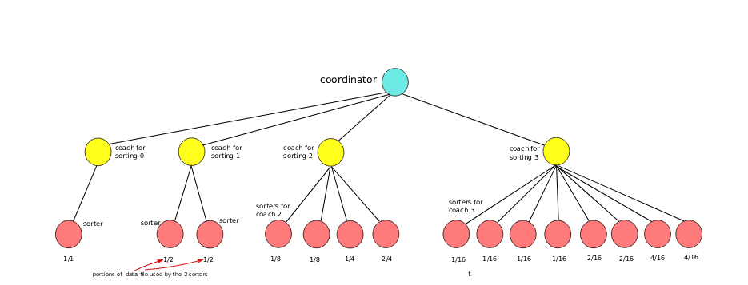

# Parallel-Sorting-Machine
A program that sorts a record list by multiple fields concurrently using multiprocessing techniques.To achieve this, the program creates 
processes using the fork() system call and loads different executables with the exec*() system calls.The process hirearchy has the form of 
a general tree with inner and leaf nodes.

## Process hirearchy


The tree's goal is to sort records using the cooperation of sorters/coaches and the coordinator. Each different node executes different operations
depending on it's role: sorters receive a range of records and sort them using quicksort or heapsort. Coaches create the right amount of sorters to
which assign the sorting they must do and in the end they merge the results from all the sorters and also send execution info for each sorter to the
coordinator. The coordinator is responsible for all processes and prints statistics for all sorts that took place.

### Node functionality
* sorter node: Receives the records filename, the order column and the sorting range from it's mother and then sorts theese records using quicksort or 
  heapsort. In the end, it passes the results to it's parent(coach).
* coach node: Receives the records filename, the order column and the number of records it contains from it's mother. It creates the necessary amount of
  sorters to sort the records by the given column. The 1st coach creates 2^0 sorters, the 2nd 2^1, the 3rd 2^2 and the 4th 2^3.
  Then, it merges the sorted records from all of them and then writes them to an ASCII file.It also passes runtime statistics to the coordinator.
* coordinator: It is responsible for creating all the process tree and watch how it goes. Depending on the command line arguments, it creates up to 4 
  coaches passing them the right arguments. For example, if the program does concurrently 4 sorts, the 4th that is done by coach3 creates 8 sorters
  which sort 1/16, 1/16, 1/16, 1/16, 2/16, 2/16, 4/16 and 4/16 of the input file records as seen in the figure above. When the coordinator selects 
  statistics from all the coaches, it prints them and completes the hirearchy job.

### Format of records in binary file
* Registry Number of type long
* First Name of type char[20]
* Last Name of typechar[20]
* Street of type char[20]
* Street Number of type int
* City of type char[20]
* Postal of type char[6]
* Salary of type float

### Compilation
```
make
```

### Execution
```
./mysort -f inputfile -h|q columnid [-h|q columnid]
```

### Clean objects and executables
```
make clean
```

## Note 
This is a project for the operating systems course of the Department of Informatics and Telecommunications at the National and Kapodistrian University
of Athens.